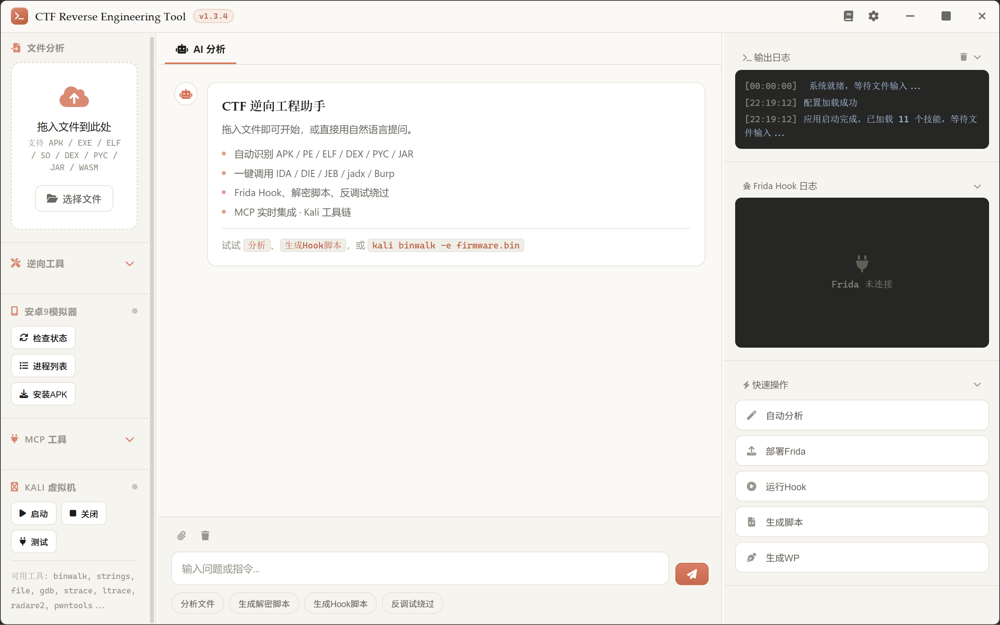

# CTF-RE-TOOL v1.3.4

[](https://github.com/ip2867/ctf-re-tool/releases)
[](LICENSE)
[]()

一个基于 Electron 的 CTF 逆向工程辅助工具，集成 **AI 分析引擎**、**一键调用逆向工具**、**Frida 自动 Hook**、**解密脚本生成**，内置 **11 个逆向方法论技能**（Skills）与**可检索知识库**（Wiki），并通过 MCP 实时接入 IDA / JEB / Burp。

**下载**：到 [Releases](https://github.com/ip2867/ctf-re-tool/releases) 下载 `CTF-RE-TOOL.exe`（便携单文件，双击即用）。

> 适用范围：CTF 竞赛、授权渗透测试、自有系统的安全研究。请勿用于未授权目标。

## 功能特性



> 三栏布局：左侧文件分析与工具区，中间 AI 对话，右侧输出日志 / Frida Hook / 快速操作。

### 1. 文件拖入+自动识别
- 支持 APK、EXE/PE（含 .NET 识别）、ELF/SO、DEX、PYC（全版本魔数）、JAR/.class、Lua 字节码、WASM、Mach-O
- ZIP 按内容精确区分 APK / JAR / 普通 ZIP
- .NET 程序集自动提示 dnSpy/ilspycmd 流程；APK 自动检测 Unity IL2CPP（global-metadata.dat）
- 显示文件详细信息（MD5、SHA256、大小等）

### 2. 一键调用逆向工具
**静态分析工具：**
- IDA Pro - 静态分析
- DIE - 查壳工具
- JEB - Android 分析
- jadx - DEX→Java 反编译

**脱壳工具：**
- UPX - 脱壳工具
- apktool - APK 解包

**Python工具：**
- pycdc - Python 字节码反编译
- pycdas - Python 字节码反汇编

### 3. Frida 自动 Hook
- 自动生成 Hook 脚本模板
- 支持 Java 层 Hook（Cipher、String、MessageDigest、SharedPreferences、Base64）
- 支持 Native 层 Hook
- 实时显示 Hook 日志

### 4. 解密脚本生成
- 自动生成 Python 解密脚本
- 支持常见算法：AES、DES/3DES、TEA、XXTEA、RC4、XOR、Base64（含自定义码表）、CRC32、SM4（国密）
- RSA 攻击脚手架（小指数/factordb/Wiener/共模）、Z3 约束求解、angr 符号执行模板

### 5. 反调试绕过
**Android：**
- ptrace 检测绕过、Debuggable 标志清除
- Frida 文件/端口检测绕过、TracerPid 检测绕过
- System.exit / Process.killProcess / Debug.isDebuggerConnected 绕过

**Windows PE（新增）：**
- IsDebuggerPresent / CheckRemoteDebuggerPresent / PEB BeingDebugged
- NtGlobalFlag / NtQueryInformationProcess / OutputDebugString 绕过

**APK 重打包（新增）：**
- apktool 解包 → smali patch → 回编 → zipalign + jarsigner 签名 一键批处理

### 6. AI 分析引擎（流式输出）
- 兼容 CCSwitch/GLM 的 Anthropic `/v1/messages` 接口
- SSE 流式逐字渲染，发送按钮可随时停止 AI 任务
- 429/5xx 自动退避重试；max_tokens 可配置
- Tool Use 循环（工具结果自动截断，防止撑爆上下文）
- AI 系统提示使用真实 MCP 连接状态，flag 用 `[FLAG]...[/FLAG]` 契约标记便于程序提取

### 7. Agent Skills 知识库（v1.2 新增）
- `skills/` 目录 + SKILL.md 格式，兼容 Anthropic Agent Skills / ljagiello·ctf-skills（MIT）
- 内置 11 个中文方法论文档：`ctf-writeup`（提交级题解写作）、`ctf-reverse-android`、`ctf-reverse-binary`、`ctf-reverse-tooling`（Z3/angr/Unicorn 自动化求解 + 迷宫题）、`ctf-reverse-langs`（Python 字节码/Go/Rust/Lua 语言特定逆向）、`ctf-iot-firmware`（固件提取/解包/QEMU 仿真）、`ctf-crypto-identify`、`ctf-antidebug`、`ctf-frida-dynamic`、`ctf-jsreverse`（JS/Web 逆向五阶段）、`ctf-dispatch`（分流与卡题决策）
- AI 可通过 `read_skill` 工具按需加载（渐进披露，不占固定提示词）；系统提示只注入技能索引
- 用户可往 `%APPDATA%/ctf-reverse-tool/skills/` 或应用 `skills/` 目录放自己的 SKILL.md，重启即生效

### 8. CASE 证据体系 + 验证闭环（v1.2 新增）
- 拖入文件自动建案：`cases/<题名>_<md5前8>/`，含 `evidence/`（MCP 采集物落盘）、`scripts/`、`timeline.jsonl`（全量日志时间线）、`findings.json`（结构化发现）
- flag/解题记录双写：原 `solveNotes` 兼容保留，新增结构化 findings（含来源与时间戳）
- **验证闭环**：AI 按契约输出 `[VERIFY]{"algo","key","ciphertext","expected"}[/VERIFY]` → 工具自动生成 Python 本地复现 → flag 标 ✅已验证 / ⚠️未验证
- **本地枚举**：AI 给出 `[HYPOTHESES][...][/HYPOTHESES]` 候选组合（算法/密钥/字节序），工具并行枚举全部组合，命中即停；验证失败自动触发，也可聊天输入 `枚举假设` 手动触发

### 9. WP 双轨（v1.2 新增）
- 模板轨（`wp` 命令 / "生成WP"按钮）：升级为 findings 驱动——证据清单、flag 验证状态自动填充，无数据才留占位
- AI 轨（`aiwp` 命令）：按 ctf-writeup 技能生成"摘要-分步解法-单一完整求解脚本-Flag"提交级题解，AI 失败自动回退模板轨

### 10. Burp MCP + JS 逆向（v1.3 新增）
- **Burp MCP 客户端**：会话握手/工具发现与 IDA 同款（Streamable HTTP），AI 可搜索代理历史、取 HTTP 报文详情、调用插件暴露的任意工具
- Burp 路径可配置（在设置页指定自己的启动器路径），左侧工具区一键启动，MCP 栅格一键连接，`burp 启动`/`burp 历史` 聊天命令
- **ctf-jsreverse 技能**：五阶段流程（观察→捕获→复现→验证→记录）；路径A 算法追踪四板斧 vs 路径B 环境伪装；JSVMP/瑞数/obfuscator.io 判型速查；案例坑库（TikTok X-Bogus、抖音 a_bogus、瑞数 sdenv）
- **node_js 验证契约**：AI 还原的 JS 加密函数经 `[VERIFY]{"algo":"node_js","code":"function decrypt(input){...}","input":"参数原文","expected":"密文"}` 交给本地 node 复现，与抓包密文比对
- **全局经验库**（reverse-skill 进化层思路）：`经验 <一句话>` 回写，下次解题自动注入 AI 提示词速查；`查经验` 查看

### 11. 知识库 Wiki（可检索手法页）
- `wiki/` 目录存放可检索的手法/代码片段页（Markdown），AI 经 `wiki_search` 找页、`wiki_read` 读全文，系统提示只注入页面索引
- 内置 Frida 专题（多阶段 hook、进程内解密、Native 密钥反演、参数编码还原）与固件专题（解包/仿真踩坑）
- 用户可往 `%APPDATA%/ctf-reverse-tool/wiki/` 放自己的页面，重启即生效

## 环境要求

- Windows 10/11
- Node.js 18+
- Python 3.10+（用于解密脚本）
- 安卓9模拟器（ADB端口：62025，Frida端口：27042）

## 打包成单文件 exe

```bash
npm install            # 首次：装依赖（含 electron-builder）
npm run build:exe      # 产物：dist/CTF-RE-TOOL.exe（便携版，双击即用）
```

- 产物为便携单文件 exe（无需安装），图标取自 `assets/icons/icon.ico`
- 打包后取证目录 `cases/`、脚本目录 `scripts/` 会自动落到 `%APPDATA%/ctf-reverse-tool/` 下
  （打包态 `app.getAppPath()` 是只读 asar，不能写入，见 `main.js` 的 `writableBase()`）
- 首次构建需下载 Electron 运行时与打包工具二进制；国内网络建议走镜像：
  ```bash
  set ELECTRON_BUILDER_BINARIES_MIRROR=https://registry.npmmirror.com/-/binary/electron-builder-binaries
  ```

## 工具路径配置

本工具是一个**框架**——它调用外部逆向工具干活，本身不含这些工具。首次运行请在应用内「**设置**」页把工具路径填成你机器上的实际路径，配置保存到 `%APPDATA%\ctf-reverse-tool\config.json`。

需要的工具（JEB/jadx/apktool/UPX/DIE/pycdc/Frida/Nox 模拟器等）请从各自官网获取；IDA Pro、JEB、Burp Suite 为商业软件，需自行购买授权。

`electron/main.js` 的 `DEFAULT_CONFIG` 中所有工具路径默认为**空字符串**（占位），由用户在设置页填入，例如：

```javascript
tools: {
  ida:    'C:\\Tools\\IDA\\ida.exe',
  jadx:   'C:\\Tools\\jadx\\bin\\jadx-gui.bat',
  apktool:'C:\\Tools\\apktool\\apktool.jar',
  upx:    'C:\\Tools\\upx\\upx.exe',
  nox_adb:'C:\\Program Files\\Nox\\bin\\nox_adb.exe'
}
```

## 安装与运行

```bash
# 克隆项目
git clone <repository-url>
cd ctf-tool-v2

# 安装依赖
npm install

# 启动应用
npm start

# 或者双击 启动.bat
```

## 项目结构

```
ctf-tool-v2/
├── package.json          # 项目配置 + electron-builder 打包配置
├── electron/
│   ├── main.js           # Electron 主进程（IPC、工具调用、MCP、打包路径处理）
│   └── preload.js        # 预加载脚本（contextBridge 暴露 API）
├── src/
│   ├── index.html        # 主页面
│   ├── css/style.css     # 样式（暖白简约主题）
│   └── js/app.js         # 应用逻辑（AI 编排、Hook、验证闭环）
├── skills/               # 11 个逆向方法论技能（SKILL.md）
├── wiki/                 # 可检索知识库（手法页 + 踩坑）
├── assets/icons/         # 应用图标
├── LICENSE               # MIT
├── 启动.bat              # Windows 快速启动
└── README.md
```

> `dist/`（打包产物）、`cases/`（取证目录）、`scripts/`（生成脚本）为运行期产物，不入库。

## 使用说明

### 基本操作

1. **拖入文件**：将 APK/EXE/ELF 等文件拖入左侧区域
2. **查看信息**：自动显示文件类型、MD5、SHA256 等信息
3. **启动工具**：点击工具按钮直接启动对应逆向工具
4. **生成脚本**：点击快速操作按钮生成 Frida/解密脚本

### 分析流程（基于ctf-agent）

**APK分析：**
1. DIE查壳 → 有壳则脱壳
2. jadx/JEB静态分析
3. 定位关键函数
4. Frida Hook动态分析
5. 算法还原 → Python解密脚本

**PE分析：**
1. DIE查壳 → 有壳则脱壳
2. IDA静态分析
3. 反调试检测与绕过
4. 算法识别
5. 解密脚本生成

**ELF分析：**
1. IDA静态分析
2. 反调试检测与绕过
3. 算法识别
4. Frida动态分析

### 快捷键

- `Enter` - 发送消息
- `Shift+Enter` - 换行

## Claude API 配置（兼容 CCSwitch）

本应用会读取 CCSwitch/Claude Code 使用的环境变量，并直接调用 Anthropic-compatible `/v1/messages` 接口：

- `ANTHROPIC_BASE_URL`：例如 `https://llm.goaichat.top`
- `ANTHROPIC_AUTH_TOKEN`：CCSwitch 当前 Token
- `ANTHROPIC_MODEL`：例如 `glm-5.3`

也支持 `CTF_CLAUDE_BASE_URL`、`CTF_CLAUDE_API_KEY`、`CTF_CLAUDE_MODEL` 覆盖上述值。启动前可在 PowerShell 中设置（不要把真实 Token 写入源码或 README）：

```powershell
$env:ANTHROPIC_BASE_URL = "https://llm.goaichat.top"
$env:ANTHROPIC_AUTH_TOKEN = "重新生成的 Token"
$env:ANTHROPIC_MODEL = "glm-5.3"
npm start
```

应用会自动请求 `${ANTHROPIC_BASE_URL}/v1/messages`。如果 CCSwitch 提供的是完整 `/v1/messages` URL，请去掉该后缀。若从 CCSwitch 启动本应用，请确认 Electron 子进程继承了这些环境变量；否则将变量设置为 Windows 用户环境变量或使用同一 PowerShell 启动。

你在对话中贴出的 Token 已经暴露，请在 CCSwitch/服务端立即撤销并重新生成。


本项目默认使用 **夜神模拟器 Nox（Android 9）**，不是雷电（LDPlayer）。默认配置为：

- ADB：`127.0.0.1:62025`
- Frida 转发端口：`127.0.0.1:27042`
- ADB 程序：`<Nox安装目录>\bin\nox_adb.exe`（在设置页配置实际路径）

因此**不需要另外下载雷电 App**。如果你使用 LDPlayer，需要在配置中改成 LDPlayer 的 ADB 路径和实际端口，并确认设备架构与 `frida-server` 一致。

### 首次部署 Frida

1. 在模拟器中开启 Root，并确认设备在线：

```bat
<nox_adb路径> connect 127.0.0.1:62025
<nox_adb路径> -s 127.0.0.1:62025 shell getprop ro.product.cpu.abi
<nox_adb路径> -s 127.0.0.1:62025 devices
```

2. 从 Frida Releases 下载与电脑端 `frida` 版本相同、架构匹配的 `frida-server`，然后部署：

```bat
<nox_adb路径> -s 127.0.0.1:62025 push frida-server /data/local/tmp/frida-server
<nox_adb路径> -s 127.0.0.1:62025 shell su -c "chmod 755 /data/local/tmp/frida-server"
<nox_adb路径> -s 127.0.0.1:62025 shell su -c "/data/local/tmp/frida-server -D"
<nox_adb路径> -s 127.0.0.1:62025 forward tcp:27042 tcp:27042
frida-ps -H 127.0.0.1:27042
```

3. 软件中点击“Frida进程”确认能列出进程，再点击“运行Hook”。运行前先安装并启动 APK；软件会抓取约 20 秒 Hook 输出。也可以在终端持续运行：

```bat
frida -H 127.0.0.1:27042 -n "包名或进程名" -l hook.js
```

若提示 `unable to connect`，依次检查：模拟器在线、`frida-server` 正在运行、PC 端 `frida` 与 server 版本一致、端口转发存在、目标进程已经启动。

## IDA MCP（ELF/PE）要求

“ELF 一键 AI 分析”需要 **IDA 已打开当前 ELF/PE 文件，并且 IDA MCP 插件正在监听 `http://127.0.0.1:13337/mcp`**。应用现在会完成 MCP 会话握手、读取 `tools/list`、兼容 JSON/SSE 响应并按实际工具名调用。若端口未监听，先在 IDA 中启用 MCP 插件，再重试；日志中应看到“IDA MCP 已连接”和工具发现结果。

Android/APK 流程使用 JEB MCP（默认 `127.0.0.1:16161`），与 IDA MCP 是两套独立服务，所以 APK 正常不代表 IDA 已启动。


## 更新日志

### v1.3.4 (2026-10-09) — 知识库扩充 + 固件逆向 + 开源发布
- **知识库技能 8→11**：新增 `ctf-reverse-tooling`（Z3/angr/Unicorn 自动化求解 + 迷宫题）、`ctf-reverse-langs`（Python 字节码/Go/Rust/Lua 语言特定逆向）、`ctf-iot-firmware`（固件提取/解包/QEMU 仿真）
- **知识库 Wiki**：`wiki/` 可检索手法页（`wiki_list`/`wiki_search`/`wiki_read`），系统提示只注入页面索引；内置 Frida 专题 + 固件解包/仿真专题
- **Hook 进程内解密直接出 flag**：把已求解的 key/iv/密文注入 Hook 脚本，运行时捕获明文，绕过关卡直接解出；滚动窗口抓取（每来数据续 60s，绝对上限 10min）
- **命令注入收口**：新增参数化执行原语 `run-tool-args`（argv 数组，无 shell 解析）、纯 Node `zip-list`/`grep-in-dir`，渲染层不再拼接 PowerShell/cmd 命令字符串
- **文件 IPC 边界**：`write-file`/`read-file`/`ensure-dir`/`append-file` 加写入根约束（userData/应用目录/临时目录/CASE 目录），并屏蔽读取工具自身凭据配置
- **Electron 加固**：`webPreferences` 启用 `sandbox`，拦截 `will-navigate` 与 `setWindowOpenHandler`（外部链接一律交系统浏览器）
- **界面**：暖白简约主题；键盘焦点环（`:focus-visible`）+ 减少动效支持；移除说明书弹窗
- **打包**：electron-builder 输出便携单文件 `CTF-RE-TOOL.exe`（含应用图标）
- **仓库卫生**：`node_modules`/`HANDOFF.md`/`.zcode` 计划/一次性调试脚本取消入库，重写 `.gitignore`

### v1.3.3 (2026-09-12) — 第四轮复审（自动化流程专项）
- P0：processUserMessage 的 hasWord 在声明前使用（TDZ），英文消息含 "script" 一词即静默崩溃 → 提升至函数顶部
- P1：analyzeWebJS 全程占锁（轮询阶段此前不加锁，可并发双流程造成流错乱）；两个轮询循环可通过再点发送键中止（flowAbortRequested）
- P1：Burp 传输探测双重 initialize（严格 Streamable 服务器会拒绝导致误判回落 SSE）→ 复用 burpHttpEnsureSession
- P2：tools/call 超时不再重试（防非幂等重复执行）；SSE 连接失败路径补 waiter 清理；JS 文件读证失败不再中断流程；AI 空结果单列提示；experience.md 表头判断修正（read-file 返回 {success:false} 而非抛异常）
- 知识库：ctf-dispatch 分流表补 Web/JS/加密参数 → ctf-jsreverse 路由 + 下一步菜单模式 + 经验库优先原则

### v1.3.2 (2026-09-12) — Web/JS 逆向全自动工作流
- **像 IDA/JEB 一样自动拉起工具链**：说"分析这个站的加密参数"即触发——自动探测 Burp（9876）→ 未运行自动启动 MCP_Burp.bat 并轮询就绪（150s）→ 自动连 MCP → 无流量自动拉起**走 Burp 代理的隔离浏览器**（Chrome/Edge 自动探测 + 独立 user-data-dir 保证代理生效 + 忽略证书告警）→ 后台轮询等流量（90s）→ AI 接手按 ctf-jsreverse 五阶段分析
- 新增 IPC：burp-probe（TCP 快探）/ open-proxy-browser（代理浏览器）；新增 web 配置组（浏览器路径/Burp 代理端口，设置页可视化）
- .js/.mjs/.html 拖入即走 Web 流程（JS 原文自动存 evidence）；`burp 启动` 现在启动后自动连接 MCP
- 逻辑单测：路由正则触发/不触发用例、历史空判断（结构化 JSON 检测，10 用例）、浏览器候选探测

### v1.3.1 (2026-09-12) — Burp MCP 实装完成
- 本地 Burp 2025.11.2 全链路实装官方 MCP Server 扩展（burp-suite v1.1.2）：jar 下载 → mcp_user_options.json 免 GUI 自动加载（MCP_Burp.bat 追加 --config-file）→ GUI 勾选 Loaded/Enabled/历史免审批
- 客户端重写为双传输自适应（auto：先 Streamable HTTP 社区扩展，失败转经典 SSE 官方扩展）；SSE 端点路径多候选（/sse 与 /）；notification 不占 pending 超时；URL 变更自动重置传输探测
- 实测：9876 监听 ✓、initialize/tools/list 握手 ✓、27 个工具全部发现（get_proxy_http_history / send_http2_request / get_scanner_issues / Repeater / Collaborator / 编解码）
- 参数适配单测 6 场景全过；tools.burp 默认启动器改为 MCP_Burp.bat

### v1.3.0 (2026-09-12)
Burp MCP 集成 + JS 逆向能力（工作思路参考 reverse-skill 与 hello_js_reverse_skill，择优吸收）：
- Burp MCP 客户端（逻辑名映射：history/message + 任意工具透传），MCP 栅格/工具区/聊天命令三处入口；.bat/.vbs 启动器支持
- 新增 ctf-jsreverse 技能：五阶段流程、路径A算法追踪四板斧、路径B环境伪装、JSVMP/瑞数/obfuscator 判型、案例坑库
- 验证闭环支持 node_js 契约：AI 还原的 JS 函数本地 node 复现（修复 argv 取参 bug 并端到端实测）
- 全局经验库：`经验 <内容>` 回写 / `查经验` 查看 / 自动注入 AI 系统提示（近15条）
- 参考来源：[reverse-skill](https://github.com/zhaoxuya520/reverse-skill)（MIT）

### v1.2.2 (2026-09-12)
第三轮复审（CSS/UI 层 + 知识库技术细节）：
- P1：Frida 输出面板换行丢失+长 hex 行被裁剪（补 pre-wrap/break-all）；日志长 token 同样裁剪；聊天气泡长 base64/哈希撑破面板 + 行内 code 无样式
- P2：流式光标闪烁动画；"分析结果"tab 标题/段落/flag 候选排版（此前被全局 margin 归零挤压）；说明书 help-note 提示框样式；移除分析 tab 双层嵌套 padding；MainActivity 识别支持 activity-alias；自动求解中止提示优化；findings.json 串行化写队列防并发交错
- 知识库：SM4 描述修正（非平衡 Feistel）；7 个 SKILL.md 机器校验（frontmatter/代码围栏闭合/交叉引用/乱码）全部通过；密码学常量与反调试偏移逐项人工复核

### v1.2.1 (2026-09-12)
系统性架构+知识库复审（独立代理交叉审查）修复：
- P0：PE/ELF"详细分析"传入空对象导致 `otherFunctions.length` TypeError，Tool-Use 深度分析必挂
- P1：CSP 使内联 onclick 失效（清空日志按钮同时会折叠面板）；解密模板中 xxtea 实现错误（TEA 风格轮函数，解出乱码）改为正确 MX 算法；`[VERIFY]`/`[HYPOTHESES]` 契约解析遇 custom 代码中的 `}`/`]` 截断（改匹配闭合标签）；Python 求解器契约改 base64 内嵌（三引号守护本就无效）
- P2：验证命中只标命中 flag；AI 中止显示为提示而非错误；聊天路由 pe/tea/md5/crc 等改词边界（"open/steal"不再误触发）；移除 data-collapse 死代码；grep 默认根目录对齐工作目录；browser_search/open 从占位接为真实调用；流式重试不再造成文本重复；PYC 魔数收紧（校验第 2 字节 0x0D）；移除无效 defaultFilter；kali 启动失败如实报错；Frida 17 API 兼容 shim 内置到全部模板；设置页新增"测试AI连接"；安装 APK 前设备就绪轮询
- 知识库：ctf-crypto-identify 契约算法清单与求解器实现对齐；ctf-frida-dynamic 补充 Frida 17+ API 变更说明

### v1.2.0 (2026-09-11)
- Agent Skills 引擎：7 个内置中文方法论 skill（写题解/Android/二进制/算法识别/反调试/Frida/调度），AI 经 `read_skill` 按需加载，用户可自装
- CASE 证据体系：每题独立目录（evidence/scripts/timeline.jsonl/findings.json），MCP 采集物自动落盘
- 验证闭环：`[VERIFY]` 契约 → 自动生成 Python 本地复现 → flag 标注 ✅已验证/⚠️未验证
- 本地枚举：`[HYPOTHESES]` 契约 → 组合枚举一键跑完（TEA/XTEA/XXTEA/RSA字节序/密钥编码歧义等），验证失败自动触发
- WP 双轨：模板轨升级为 findings 驱动（证据清单+验证状态自动填充）；AI 轨（`aiwp`）按 ctf-writeup 技能产出提交级题解，失败自动回退
- 参考 [ljagiello/ctf-skills](https://github.com/ljagiello/ctf-skills)（MIT）与 [anthropics/skills](https://github.com/anthropics/skills) 的 SKILL.md 组织方式

### v1.1.0 (2026-09-11)
**缺陷修复**
- 修复 JEB MCP 一键启动读取错误配置键（`mcp.jeb` → `mcp.jebMcpScript`）的问题
- 修复聊天/日志/Frida 输出的 HTML 注入（XSS）漏洞
- 修复 MainActivity 误识别：现在精确解析 Manifest 中的 LAUNCHER activity
- 修复 APK 自动分析结果虚假成功提示：每步真实汇报 ✅/❌
- 修复 PYC 魔数只认旧版本、`.zip` 一律当 APK、kali-stop-vm 空 vmx 等问题
- 修复设置保存丢失 nox_path/mcp/kali 配置段、WP 保存后脚本类型错乱等问题

**健壮性与体验**
- AI 回复 SSE 流式输出 + 发送按钮一键停止
- JEB/IDA MCP 连接改为就绪轮询；模拟器等待不再固定 60 秒
- 429/5xx 指数退避重试；`max_tokens` 可在设置中调整（默认 8192）
- `saveScript` 实现系统保存对话框；聊天工具栏按钮接线；新增"分析结果"标签页
- 设置页新增 AI 接口 / MCP 地址 / Kali SSH / 输出目录 配置
- 硬编码路径与端口（frida 27042、ADB 62025、scripts 目录、VS Code、JEB MCP 脚本）全部进配置

**解题能力扩展**
- 文件分流新增：JAR/.class（jadx）、.NET（dnSpy/ilspycmd 指引）、Unity IL2CPP（Il2CppDumper 指引）、Lua 字节码（unluac）、Mach-O 指引
- 解密模板新增：SM4、3DES、自定义码表 Base64、RSA（小指数/factordb/Wiener/共模）、Z3、angr
- 新增 Windows PE 反调试绕过 Frida 脚本、smali 重打包签名批处理脚本
- RC4 动态脚本参数化（模块名/RVA 弹窗输入，不再硬编码 2.exe）
- WP 报告增强：多格式 flag 提取（flag/ctf/NSSCTF/SCTF…）、关键结论区块、真实连接状态
- flag 统一提取函数，支持 `[FLAG]...[/FLAG]` 输出契约

**安全加固**
- adb/frida/launch-tool/vmrun 全部改为 spawn 参数数组，消除命令注入面
- Kali SSH 改用 ssh2 库（原 sshpass 方案在 Windows 不可用）；密码不再写死在源码
- `shell.openExternal` 仅允许 http/https；新增 CSP；FontAwesome 加 SRI
- 工具输出统一 8000 字符截断（IPC 与 AI 上下文双重保护）

### v1.0.0 (2026-07-23)
- 初始版本发布
- 支持文件拖入和自动识别
- 集成 IDA、DIE、JEB、jadx、UPX、apktool、pycdc 等工具
- Frida Hook 脚本生成（基于ctf-agent模板）
- Python 解密脚本生成（支持多种算法）
- 反调试绕过脚本生成（支持多种绕过技术）
- 响应式窗口布局

## 许可证

MIT License
